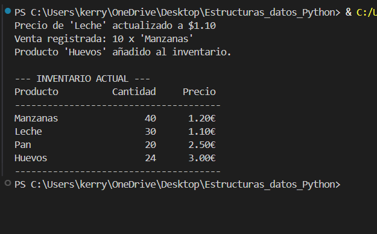
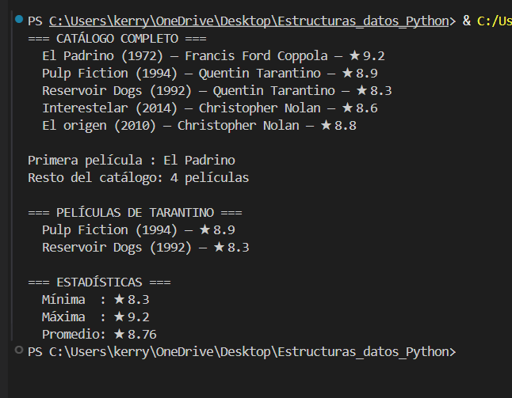
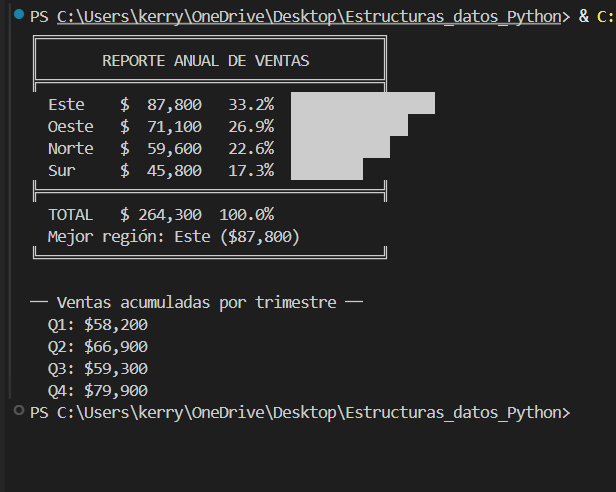
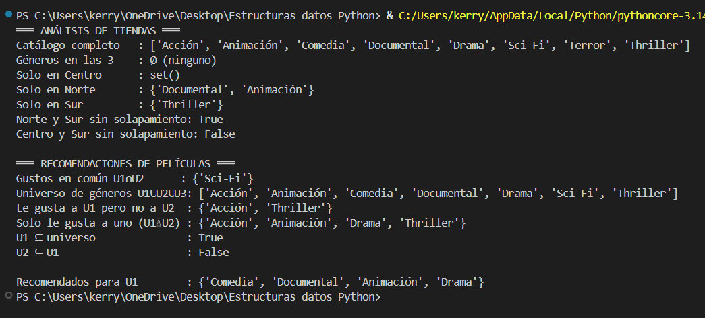
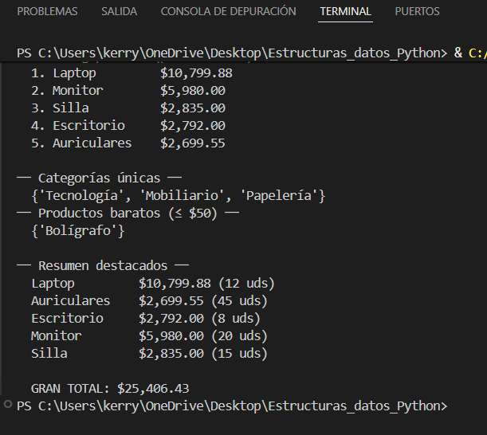

# 🐍 Python — Estructuras de Datos

> Retos resueltos del curso de Python cubriendo las estructuras de datos fundamentales del lenguaje.

---

## 📁 Estructura del proyecto

```
📦 proyecto/
├── 📄 README.md
└── 📂 src/
    ├── 📂 Listas/
    │   └──  gestion_inventario.py
    ├── 📂 Tuplas/
    │   └──  sistema_peliculas.py
    ├── 📂 diccionarios/
    │   └──  analisis_venta_region.py
    ├── 📂 Conjuntos/
    │   └──  tiendas_recomend_pelis.py
    ├── 📂 ventas_3_comprehensions/
    │   └──  comprehensions.py
    └── 📂 images/
        ├── 🖼️ listas.png
        ├── 🖼️ tuplas.png
        ├── 🖼️ diccionarios.png
        ├── 🖼️ conjuntos.png
        └── 🖼️ comprehension.png
```

---

## 📚 Temas aprendidos

| Módulo | Tema | Conceptos clave |
|--------|------|-----------------|
| 01 | **Listas** | Listas anidadas, mutabilidad, `append()`, indexación |
| 02 | **Tuplas** | Inmutabilidad, desempaquetado, operador `*`, retorno múltiple |
| 03 | **Diccionarios** | Clave→valor, `items()`, `get()`, dicts anidados, `lambda` |
| 04 | **Conjuntos** | `union()`, `intersection()`, `difference()`, operadores `& | - ^` |
| 05 | **Comprehensions** | List, dict y set comprehension, filtros, pipelines de datos |

---

## ✅ Retos resueltos

### 📋 Módulo 01 — Gestión de inventario
> Sistema de inventario con listas anidadas `[nombre, cantidad, precio]`. Implementa actualización de precios, registro de ventas con control de stock y adición de productos.

**Archivo:** `src/Listas/gestion_inventario.py`



---

### 🎬 Módulo 02 — Sistema de películas
> Catálogo de películas con tuplas inmutables. Desempaquetado en bucles, operador `*` para separar elementos, búsqueda por director y cálculo de estadísticas.

**Archivo:** `src/Tuplas/sistema_peliculas.py`



---

### 📊 Módulo 03 — Análisis de ventas por región
> Dict anidado con ventas trimestrales. Calcula totales por región, encuentra el máximo con `key=lambda`, acumula por trimestre y genera porcentajes con dict comprehension.

**Archivo:** `src/diccionarios/analisis_venta_region.py`



---

### 🏪 Módulo 04 — Tiendas y recomendaciones de películas
> Análisis de catálogos de tres tiendas con métodos de conjuntos. Sistema de recomendación de géneros cinematográficos usando operadores matemáticos de sets.

**Archivo:** `src/Conjuntos/tiendas_recomend_pelis.py`



---

### ⚡ Módulo 05 — Analizador de ventas con comprehensions
> Pipeline completo sobre un dataset de ventas usando las tres comprehensions: list para totales, dict para rankings, set para categorías únicas.

**Archivo:** `src/ventas_3_comprehensions/comprehensions.py`



---

## 💭 Reflexión personal

A lo largo de estos módulos entendí que cada estructura de datos existe por una razón concreta:

- 📋 **Listas** → cuando necesito orden y poder modificar los datos
- 📌 **Tuplas** → cuando quiero garantizar que los datos no cambien
- 🗂️ **Diccionarios** → para representar entidades con atributos nombrados
- 🔵 **Conjuntos** → para operaciones de pertenencia, unicidad y comparación
- ⚡ **Comprehensions** → para transformar y filtrar colecciones de forma expresiva

El mayor cambio de mentalidad fue pasar de pensar en *bucles paso a paso* a pensar en *transformaciones declarativas*: describir **qué quiero** en lugar de **cómo construirlo**. Elegir la estructura correcta desde el principio simplifica todo el código que viene después.

---
